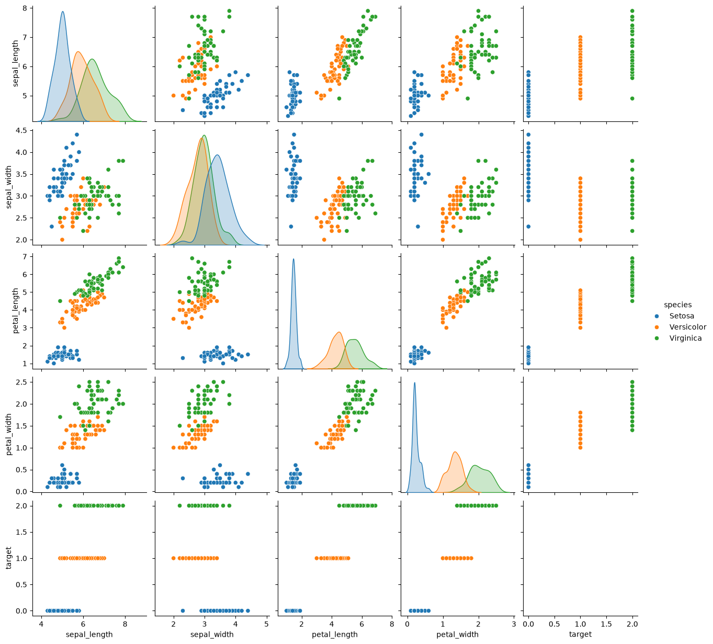
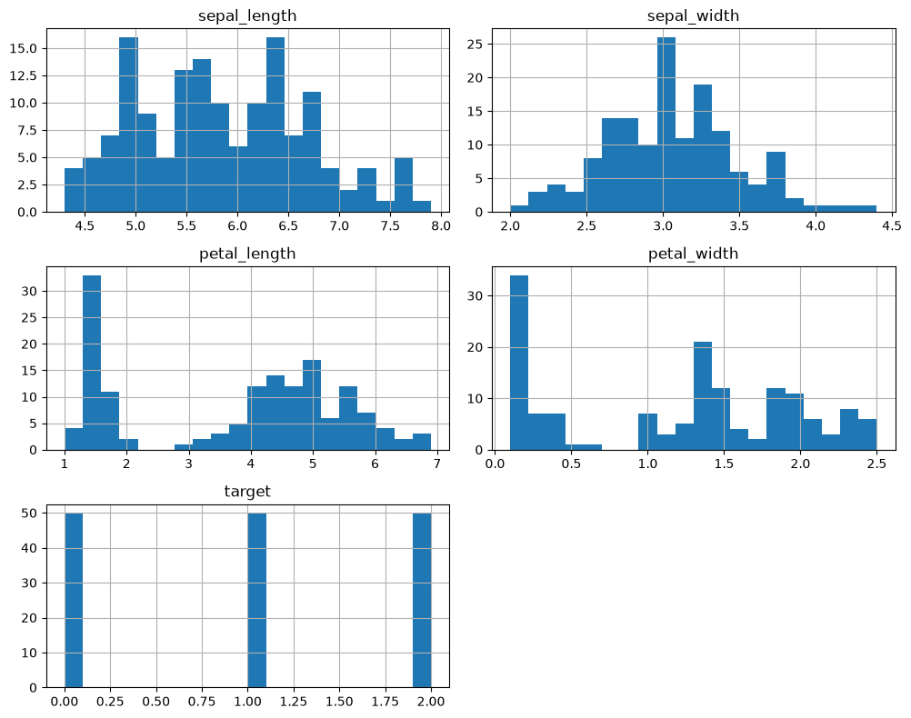
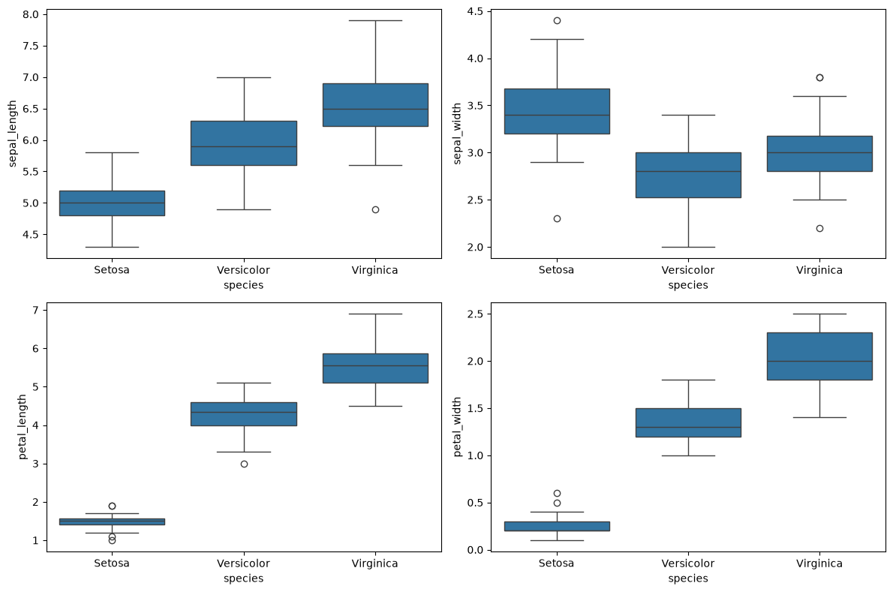
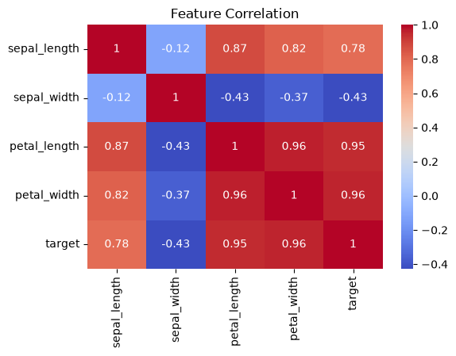

# 🌸 Task 1 — Iris Flower Classification

A machine learning project that classifies iris flowers into three species — **Setosa**, **Versicolor**, and **Virginica** — using the classic Iris dataset. This project demonstrates an end-to-end supervised classification pipeline using Logistic Regression.

---

## 📋 Table of Contents

- [Overview](#overview)
- [Dataset](#dataset)
- [Project Structure](#project-structure)
- [Installation](#installation)
- [Usage](#usage)
- [Workflow](#workflow)
- [Results](#results)
- [Technologies Used](#technologies-used)

---

## 🔍 Overview

The Iris dataset is one of the most well-known benchmarks in machine learning. This project covers:

- Loading and exploring the Iris dataset
- Visual exploration using pair plots, histograms, and box plots
- Train/test splitting (80/20, stratified)
- Training a **Logistic Regression** classifier
- Evaluating using accuracy, classification report, and confusion matrix

---

## 📊 Dataset

| Property | Value |
|---|---|
| **Source** | `sklearn.datasets.load_iris()` |
| **Total Samples** | 150 |
| **Features** | 4 (sepal length, sepal width, petal length, petal width) |
| **Classes** | 3 (Setosa, Versicolor, Virginica) |
| **Missing Values** | None |
| **Training Samples** | 120 (40 per class) |
| **Test Samples** | 30 (10 per class) |

**Feature Columns:**
- `sepal_length` (cm)
- `sepal_width` (cm)
- `petal_length` (cm)
- `petal_width` (cm)
- `species` — target label (Setosa, Versicolor, Virginica)

---

## 📁 Project Structure

```
Task1_Iris_Classification/
├── Iris_Classification.ipynb   # Main notebook with full pipeline
├── requirements.txt            # Python dependencies
├── images/                     # Saved plots and visualizations
└── README.md                   # Project documentation
```

---

## ⚙️ Installation

1. **Clone the repository:**
   ```bash
   git clone https://github.com/<your-username>/QSkill_Internship.git
   cd QSkill_Internship/Task1_Iris_Classification
   ```

2. **Create and activate a virtual environment (recommended):**
   ```bash
   python -m venv .venv
   # Windows
   .venv\Scripts\activate
   # macOS/Linux
   source .venv/bin/activate
   ```

3. **Install dependencies:**
   ```bash
   pip install -r requirements.txt
   ```

---

## 🚀 Usage

Launch Jupyter Notebook and open the main notebook:

```bash
jupyter notebook Iris_Classification.ipynb
```

Run all cells top-to-bottom to reproduce the full analysis and results.

---

## 🔬 Workflow

### 1. Loading the Dataset
The Iris dataset is loaded directly from `sklearn.datasets` and converted into a Pandas DataFrame.

### 2. Exploring the Data
- `.head()`, `.info()`, `.describe()` for a statistical overview
- Column names are cleaned (spaces replaced with underscores)

### 3. Visual Exploration
- **Pair Plot** — scatter matrix across all 4 features, colored by species
- **Histograms** — distribution of each feature
- **Box Plots** — feature distributions grouped by species (2×2 grid)
- **Correlation Heatmap** — feature correlation matrix

#### Pair Plot


#### Histograms


#### Box Plots


#### Correlation Heatmap


### 4. Train-Test Split
The data is split 80/20 using `train_test_split` with:
- `random_state=42` for reproducibility
- `stratify=y` to maintain equal class proportions

### 5. Model Training
A **Logistic Regression** model is trained on the 120-sample training set:
```python
model = LogisticRegression(random_state=42)
model.fit(X_train, y_train)
```

### 6. Predictions & Evaluation
The model generates predictions on the 30-sample test set and is evaluated with:
- **Accuracy Score**
- **Classification Report** (precision, recall, F1-score per class)
- **Confusion Matrix** (heatmap visualization)

---

## 📈 Results

| Metric | Value |
|---|---|
| **Accuracy** | **100%** |

**Classification Report:**

|  | Precision | Recall | F1-Score | Support |
|---|---|---|---|---|
| **Setosa** | 1.00 | 1.00 | 1.00 | 10 |
| **Versicolor** | 1.00 | 1.00 | 1.00 | 10 |
| **Virginica** | 1.00 | 1.00 | 1.00 | 10 |
| **Accuracy** | | | **1.00** | 30 |

**Confusion Matrix:**

```
[[10  0  0]
 [ 0 10  0]
 [ 0  0 10]]
```

> The Logistic Regression model achieved perfect classification on the test set, with **zero misclassifications**. This demonstrates that the four flower measurements (sepal/petal length and width) are highly effective for distinguishing the three iris species.

---

## 🛠️ Technologies Used

| Library | Version | Purpose |
|---|---|---|
| `numpy` | ≥1.24 | Numerical computations |
| `pandas` | ≥2.0 | Data manipulation |
| `scikit-learn` | ≥1.3 | Logistic Regression, train/test split, metrics |
| `matplotlib` | ≥3.7 | Plotting (histograms, confusion matrix) |
| `seaborn` | ≥0.12 | Pair plots, box plots, heatmaps |
| `jupyter` | ≥1.0 | Interactive notebook environment |

---

## 👤 Author

**QSkill Internship Project**  
Part of the Machine Learning Internship Task Series.
